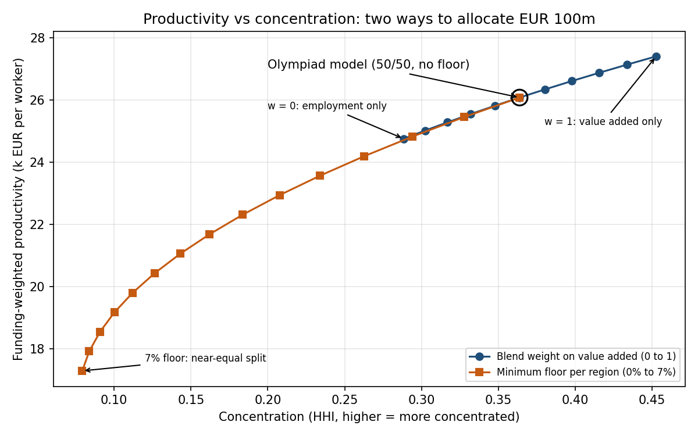

# Regional Fund Allocator

How should a ministry split €100m across Greece's 13 regions? This project compares allocation rules, measures how concentrated each one is, stress-tests them against data error, and backtests them against what actually happened.

This is my answer for the final of the **Hellenic Statistics Olympiad 2026**. The task was to propose a funding rule for the trade sector (NACE Sector Ζ, wholesale and retail trade).   



## What it does

| Stage | Question | Method |
|---|---|---|
| 1. Compare rules | Who gets what under each rule? | Value added share, employment share, 50/50 blend (my Olympiad model), blend with a minimum floor |
| 2. Sensitivity sweep | What does diversification cost? | Sweep the blend weight and the floor; trace concentration (HHI) against funding-weighted productivity |
| 3. Monte Carlo | Which results survive data error? | 10,000 runs with 5% normal noise on ELSTAT's estimates; 90% intervals and rank stability per region |
| 4. Backtest | Would any rule have picked the regions that grew? | Rules built on 2021 data only, scored on 2021 to 2023 growth with Spearman rank IC and a permutation test |

## Key findings

**1. The Olympiad model is highly concentrated.** Attica receives €57.55m. The allocation behaves like only 2.7 equally funded regions (HHI 0.364).

| Rule | Attica | North Aegean | HHI | Effective regions |
|---|---|---|---|---|
| Value added share | €65.36m | €0.58m | 0.453 | 2.2 |
| Employment share | €49.73m | €1.16m | 0.288 | 3.5 |
| 50/50 blend (Olympiad) | €57.55m | €0.87m | 0.364 | 2.7 |
| 50/50 blend + 2% floor | €44.58m | €2.65m | 0.234 | 4.3 |

2. Spreading the money out costs productivity. Adding a 2% floor to the Olympiad model takes it from 2.7 effective regions to 4.3. The price is funding-weighted productivity, which drops from €26.1k to €23.6k per worker, roughly 10% lower. I tested two ways of diversifying: changing the blend weight, and adding a floor. Where they overlap, they trace almost the same curve. The difference is range. The blend weight can't spread the money out any further than the employment-only split, while the floor keeps going until it's basically an equal split.

3. Only the top three positions hold up. I added 5% random error to ELSTAT's figures and reran the model 10,000 times. Attica, Central Macedonia and Crete stayed in the same place every single time. Below them it gets messy. Thessaly only held 5th place in 43% of runs, because the gaps between the mid-sized regions are smaller than the error in the data itself. In practice, the order of positions 4 to 7 shouldn't be taken too seriously.

4. The backtest doesn't pick a winner. I built each rule on 2021 data and checked it against what actually happened by 2023. On value added growth, every size-based rule did 8 to 13 points worse than simply splitting the money equally. Most of that gap comes from the islands bouncing back after losing their tourism during Covid. On employment growth it went the other way, and the size-based rules came out slightly ahead. None of the ICs were significant, since every p-value was above 0.1. That isn't surprising with only 13 regions and one time period: you'd need an |IC| of about 0.56 just to reach 5% significance. The data simply isn't enough to tell the rules apart.

5. The official data had a problem. ELSTAT's 2022 figures show negative Sector Ζ value added for Central Greece (−€676m) and the Ionian Islands (−€124m). Shares and growth rates mean nothing with a negative base, so the code throws an error instead of quietly returning garbage. That's why the backtest starts from 2021 and skips 2022.

## Project structure

```
src/allocator/
├── Main.java                  runs all four stages
├── model/                     RegionData, Metric, Dataset, Allocation
├── strategy/                  AllocationStrategy (interface) and its implementations
├── analysis/                  SensitivitySweep, MonteCarloSimulator, Backtester, RankCorrelation
└── io/                        CsvLoader, CsvWriter
test/allocator/                24 JUnit 5 tests
data/sector_z_2021_2023.csv    ELSTAT Structural Business Statistics, Sector Ζ, 13 regions, 2021 to 2023
docs/frontier.png              chart above
```

Design notes:
- Every rule shares one interface. Each allocation rule implements AllocationStrategy. So the comparison, the sweeps, the Monte Carlo and the backtest all work with any rule, and adding a new rule doesn't mean touching any of them.
- Bad output fails loudly. Allocation checks that the weights are never negative and always add up to 1. If a rule gets this wrong, the program stops with an error instead of printing numbers that look fine but aren't.
- Results are reproducible. The Monte Carlo and the permutation tests use a fixed random seed, so you get exactly the same output every time you run it.
- No external libraries. It's plain Java, version 17 or newer. JUnit 5 is only needed for the tests.

## How to run

**Eclipse:** import the project, then right-click `Main.java` → Run As → Java Application. Results are written to `results/` as CSV. To run the tests, add JUnit 5 to the build path and right-click `test` → Run As → JUnit Test.

**Command line** (macOS/Linux):
```
javac -d out $(find src -name "*.java")
java -cp out allocator.Main
```

## Limitations and next steps

- Productivity is standing in for return. Funding-weighted productivity tells you how productive the funded regions are. It doesn't measure what the money actually achieves once it gets there.
- The 5% error is my own assumption. ELSTAT publishes sampling errors, and using those would be more accurate. Employment comes from administrative records, so it probably deserves a smaller error than value added.
- The noise could technically go negative. At 5% error that never realistically happens, but a lognormal perturbation would rule it out completely.
- The backtest is tiny. One period and 13 regions isn't enough for real statistical power. More years, or finer regional data at NUTS-3 level, would help.
- What I'd build next: a cap strategy, where no region can get more than a set share, and then an optimiser that maximises productivity while keeping concentration below a limit.

## Data

Hellenic Statistical Authority (ELSTAT), Structural Business Statistics 2021 to 2023, as provided for the second stage of the 9th Panhellenic Statistics Competition. Monetary values are in thousand euros.

---
*Errikos Skiadas*
